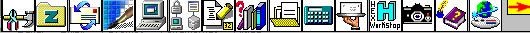



## Adauto

### Description

Make your own program bar (as Office Bar). You choose the programs that you would like to stay there and active by a click. Choose the position of the icon at the bar and so on.
 
### More Info
 

             |
---                |---
**Submitted On**   |2000-07-26 23:15:18
**By**             |[Jose Adauto Ribeiro](https://github.com/Planet-Source-Code/PSCIndex/blob/master/ByAuthor/jose-adauto-ribeiro.md)
**Level**          |Advanced
**User Rating**    |3.3 (13 globes from 4 users)
**Compatibility**  |VB 6\.0
**Category**       |[Complete Applications](https://github.com/Planet-Source-Code/PSCIndex/blob/master/ByCategory/complete-applications__1-27.md)
**World**          |[Visual Basic](https://github.com/Planet-Source-Code/PSCIndex/blob/master/ByWorld/visual-basic.md)
**Archive File**   |[CODE\_UPLOAD8582832000\.zip](https://github.com/Planet-Source-Code/jose-adauto-ribeiro-adauto__1-10375/archive/master.zip)

